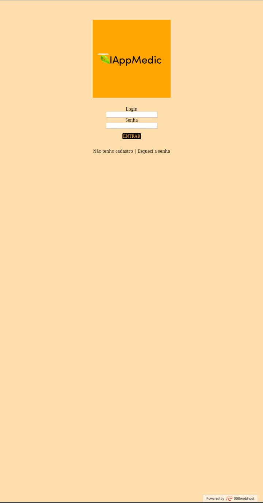
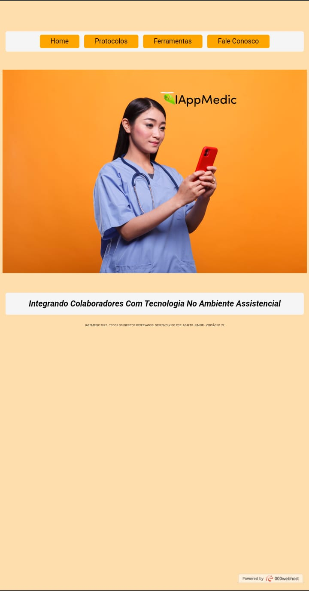
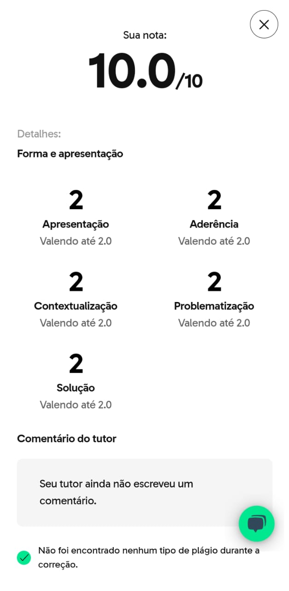

# Sobre o Projeto 

Proposta: Como 3° avalição do curso de Pós Graduação em Gestão Hospitalar, o aluno é estimulado a desenvolver um Pitch Deck como avaliação de final do curso, com o objetivo de apresentar uma solução para um problema existente de forma criativa e aplicável a sua realidade.

O que é: Pitch é uma apresentação rápida e visual de um produto, projeto ou um negócio, com a intenção de “vender” a ideia para possíveis investidores, clientes, sócios ou parceiros. Normalmente é produzido no formato de slides que dão suporte à fala de quem está expressando as ideias relevantes do projeto. Um pitch pode servir para qualquer pessoa ou empresa que precise convencer algum público a acreditar na sua ideia.

Elaboração: terceira etapa avaliativa que deverá ser realizada após o aluno concluir as disciplinas de especialização da Pós-Graduação, chamado de Pitch Deck. O mesmo deverá levantar algum problema existente em âmbito regional, social ou profissional com o intuito de apresentar soluções de desenvolvimento local.

**Resultado: atendendo ao exposto, foi criado uma proposta de plataforma de integração de novos colaboradores em um ambiente assistencial de acesso mobile, contendo as informaçãoes mais suscintas a serem repassadas a esse perfil de profissional, sobre as informaçãoes mais relevantes a serem aplicadas em sua rotina de trabalho, como: protocolos utilizados, sistemas utilizados e sua apresentação, como proceder registro de ponto, contatos, etc.** 

 

[Acesse: IappMedic.com](https://iappmedic.000webhostapp.com/)

## Layout do Projeto
 

## Tecnologias utilizadas

Front End: HTML e CSS

## Avaliação Recebida do Curso

## Autor

Adalto Carvalho Ribeiro Simão Junior - Julho 2022.

